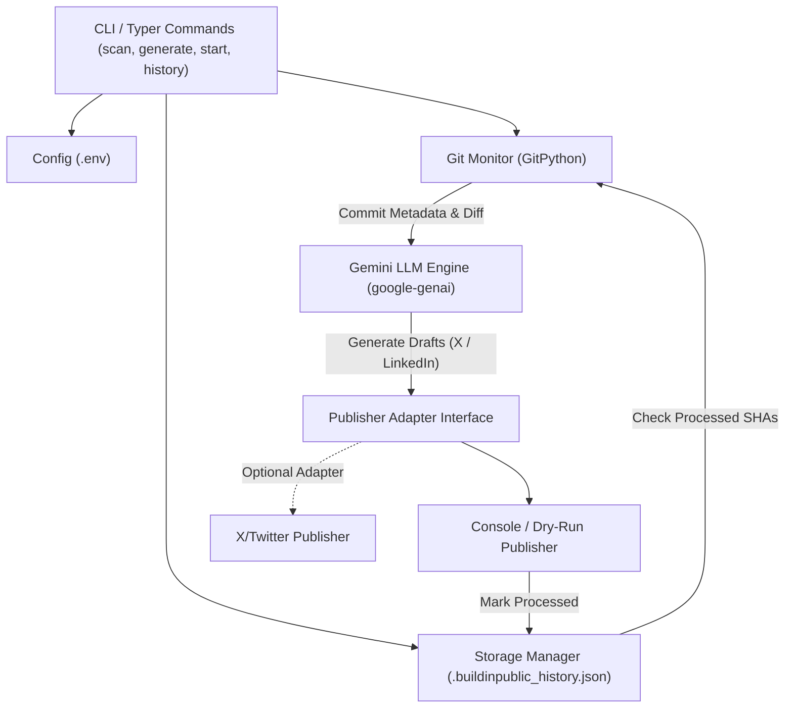

# Build in Public - Automated Content Creator

> A lightweight, zero-infrastructure Python CLI & background utility that watches local Git activity and automatically generates technical progress updates for **X (Twitter)** and **LinkedIn** using Google Gemini LLM.

---

## Key Features

- **Automated Git Activity Inspection:** Parses commit messages, author details, timestamps, diff summaries, and changed file lists.
- **LLM Content Generation:** Crafts targeted, factual updates for two platforms:
  - **X (Twitter):** Short, catchy post with 2-4 tech hashtags.
  - **LinkedIn:** In-depth, professional post explaining technical context and impact.
- **Strict Anti-Hallucination Prompting:** Ensures the LLM only references work present in the commit diff.
- **Duplicate Prevention & History:** Tracks processed SHAs in a simple local JSON file `.buildinpublic_history.json`.
- **Retry Guarantee:** A commit is marked as processed *only* after content generation succeeds. Failed attempts are retained for future retry.
- **Background Watcher Daemon:** Continuous polling loop (`buildinpublic start`) with graceful `Ctrl+C` shutdown.
- **Modular Publisher Architecture:** Extensible adapter pattern with default dry-run `ConsolePublisher` and optional `XTwitterPublisher`.

---

## Tech Stack

- **Language:** Python 3.9+
- **CLI Framework:** Typer & Rich
- **Git Interface:** GitPython
- **LLM Integration:** Official Google Gemini SDK (`google-genai`)
- **Data Modeling:** Pydantic v2
- **Config & Environment:** `python-dotenv`

---

## Architecture Overview



---

## Installation (Windows PowerShell / Cross-Platform)

```powershell
# 1. Clone repository & navigate to project root
cd "path/to/build-in-public"

# 2. Install package in editable mode
python -m pip install --no-build-isolation --no-deps -e .

# 3. Copy environment config template
Copy-Item .env.example .env
```

---

## Configuration (`.env`)

Edit `.env` to configure your Gemini API key and settings:

```env
# Required for Content Generation
GEMINI_API_KEY=your_gemini_api_key_here
GEMINI_MODEL=gemini-2.5-flash

# Repository & Application Config
GIT_REPO_PATH=.
POLL_INTERVAL_SECONDS=300
DRY_RUN=true

# Optional: Future X (Twitter) API Integration
X_API_KEY=
X_API_SECRET=
X_ACCESS_TOKEN=
X_ACCESS_TOKEN_SECRET=
```

---

## CLI Command Reference

### 1. `buildinpublic scan`
Scan repository for unprocessed commits:
```powershell
buildinpublic scan
buildinpublic scan --all   # Include previously processed commits
```

### 2. `buildinpublic generate`
Generate X and LinkedIn drafts for the latest unprocessed commit:
```powershell
buildinpublic generate
buildinpublic generate --mark-processed   # Mark commit as processed after viewing
buildinpublic generate --commit <SHA>      # Target a specific commit SHA
```

### 3. `buildinpublic start`
Launch the background watcher loop:
```powershell
buildinpublic start --interval 60
```
*Press `Ctrl+C` to stop the daemon cleanly.*

### 4. `buildinpublic history`
View previously processed commits and generated post metadata:
```powershell
buildinpublic history
```

---

## Example Output Preview

```text
============================================================
+----------------------- Title / Hook -----------------------+
| Integrated Gemini LLM Content Generator Engine             |
+------------------------------------------------------------+

+------------------- X / Twitter Post (Dry-Run) -------------------+
| Shipped LLM content generation for #buildinpublic! 🚀            |
| Turns local Git commits into technical updates automatically.    |
| #python #gemini #ai                                              |
+------------------------------------------------------------------+

+--------------------- LinkedIn Post (Dry-Run) ---------------------+
| 🚀 Exciting progress update on Build in Public!                  |
|                                                                  |
| Today I integrated Google's Gemini SDK into our Python CLI       |
| tool. Key achievements:                                          |
| • Prompt construction anchored directly to Git commit diffs      |
| • Structured output parsing via Pydantic                         |
| • Dry-run terminal rendering using Rich                          |
|                                                                  |
| #buildinpublic #python #ai #developer                            |
+-------------------------------------------------------------------+
============================================================
```

---

## Testing

Run the automated test suite (includes storage, prompt construction, publisher adapters, and background watcher mocks):

```powershell
python -m pytest tests/
```

---

## Project Folder Structure

```text
build-in-public/
├── .env.example               # Configuration template
├── .gitignore                 # Prevents committing secrets & history
├── pyproject.toml             # Package metadata and dependencies
├── README.md                  # Comprehensive setup & usage guide
├── DEMO.md                    # 2-3 minute hackathon demo script
├── buildinpublic/
│   ├── __init__.py
│   ├── cli.py                 # Typer CLI application & commands
│   ├── config.py              # Environment variable management
│   ├── git_monitor.py         # GitPython repository inspection
│   ├── storage.py             # Local JSON commit history manager
│   ├── generator.py           # Gemini LLM prompt & response parser
│   ├── watcher.py             # Background polling loop daemon
│   ├── logger.py              # Application logger
│   └── publishers/            # Modular publisher adapters
│       ├── __init__.py
│       ├── base.py            # Abstract BasePublisher class
│       ├── console.py         # Terminal output publisher
│       └── x_twitter.py       # X/Twitter API adapter
└── tests/                     # Unit test suite
    ├── test_storage.py
    ├── test_generator.py
    ├── test_publishers.py
    └── test_background.py
```
